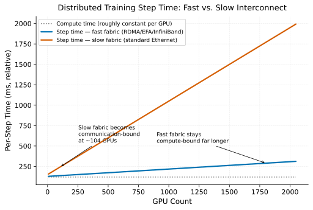

# GPU Interconnect & Collective Communication

> **A distributed training job is only as fast as its slowest link, not its fastest
> GPU.** Every parallelism strategy — data, tensor, pipeline, or sharded — eventually
> requires GPUs on different nodes to exchange data, and the fabric connecting them,
> not the GPUs' own compute throughput, is what usually caps how far a job scales.

## Why collective operations dominate distributed training cost

Data-parallel training's core communication step is an all-reduce: every GPU computes
gradients locally, then all GPUs combine (sum and broadcast) those gradients so every
replica ends up with the same updated values before the next step. This is a
**collective** operation — every participant both sends and receives, and the
operation isn't complete until every participant has finished, which means the
slowest participant sets the pace for everyone else.

The cost of an all-reduce scales with the amount of data exchanged (proportional to
model size, for gradient synchronization) and inversely with the bandwidth and latency
of the interconnect. Within a single node, GPUs typically connect via NVLink/NVSwitch
— high-bandwidth, low-latency links purpose-built for this. Across nodes, the
connection runs over the data center network, and this is where the fabric quality
diverges sharply between "properly built for distributed training" and "adequate for
general networking but not this."

## The interconnect hierarchy

Communication cost roughly follows the same locality hierarchy that governs data
access generally: same-node (NVLink) is fastest, same-rack cross-node next, and
cross-rack or cross-datacenter progressively slower. Purpose-built training fabrics
(AWS's EFA, GPUDirect-RDMA over InfiniBand on GCP/Azure) exist specifically to make
the cross-node hop as cheap as possible — bypassing the CPU and standard networking
stack so GPUs can exchange data nearly as directly as they would over NVLink, just at
somewhat lower bandwidth and higher latency.

A cluster provisioned without this — GPUs connected over standard Ethernet without
RDMA, or across availability zones without a dedicated low-latency fabric — will still
run distributed training correctly, but every all-reduce pays a much higher tax, and
that tax is paid on every single training step, not once.

Both fabrics start compute-bound at low GPU counts — communication is cheap enough
that it's hidden under compute time. As GPU count grows, communication cost grows with
it, and a slow fabric crosses into communication-bound territory far sooner than a
fast one — at that point, every additional GPU adds less useful throughput than the
communication overhead it introduces.

This is why "what's the
interconnect" is one of the first questions worth asking about any distributed
training cluster: it determines whether adding GPUs actually reduces wall-clock time,
or whether the job has already saturated whatever scaling the fabric can support.

## Topology matters as much as raw bandwidth

Beyond raw bandwidth, *where* a job's workers are physically placed relative to each
other affects collective performance. Ring and tree all-reduce algorithms (the
standard implementations in NCCL, NVIDIA's collective communication library) are
sensitive to the topology they run over — workers spread across distant racks or
switches see worse effective bandwidth than workers packed within a single fast
network domain, even on identical hardware, purely because of the extra hops and
contention involved. This is the underlying reason topology-aware scheduling exists as
a distinct concern from simple resource availability (see
[Topology-Aware Placement](../patterns/gpu-scheduling/topology-aware-placement.md)):
a scheduler that places a job's workers wherever capacity happens to be free, ignoring
network locality, can hand out a technically valid allocation that performs
substantially worse than a topology-aware one using the identical set of GPUs.

## Why this underlies so much of the rest of the guide

Nearly every pattern in
[Large-Scale Pretraining Infrastructure](../patterns/pretraining-infrastructure/index.md)
assumes this mental model: [Interconnect-Bound Distributed Training](../patterns/pretraining-infrastructure/interconnect-bound-distributed-training.md)
names the failure mode directly, [Composing Parallelism Strategies](../patterns/pretraining-infrastructure/composing-parallelism-strategies.md)
describes how different parallelism choices trade memory for exactly this
communication cost, and [Topology-Aware Placement](../patterns/gpu-scheduling/topology-aware-placement.md)
describes the scheduling-layer response to it.

## Connections to other foundations

[Failure as the Steady State at Fleet Scale](failure-as-the-steady-state.md) compounds
directly with interconnect quality: a job running over a marginal fabric that
occasionally drops or degrades a link doesn't just run slow, it can appear to hang
entirely, since a collective operation blocks on its slowest (or now-unreachable)
participant.
