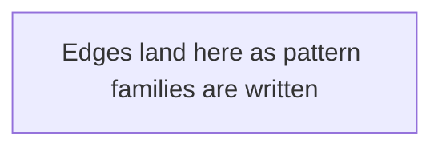

# Interaction Map

Patterns rarely fail in isolation. This map shows which patterns compound and why.

> **Status:** skeleton only — edges get added to `src/interactions.yml` as each pattern
> family is written, then this Mermaid block is regenerated. Run `make check-interactions`
> to validate.

---

---

## High-value compounds

Entries land here as pattern pages are written and their `Interactions` sections
identify compounding pairs — for example, checkpoint interval compounding with fleet
failure rate, or gang scheduling compounding with preemption policy.
