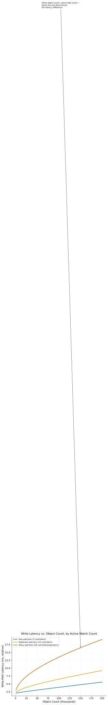

# etcd as the Hidden Bottleneck

> **One-liner:** etcd's write throughput and watch fan-out, not the apiserver's own compute, is usually the true ceiling on how large a Kubernetes cluster can grow.

## Symptom

- apiserver request latency rises steadily as cluster size (node count, object count,
  or both) grows, even though apiserver CPU and memory usage look unremarkable.
- Write-heavy workloads (many pods churning frequently, high-frequency status
  updates from controllers) degrade cluster-wide latency far more than an equivalent
  increase in read traffic does.
- etcd disk I/O latency or fsync time shows up as a leading indicator of cluster
  slowness before any other component's metrics look concerning.
- Adding more apiserver replicas (horizontal scaling) doesn't proportionally improve
  cluster responsiveness, because the bottleneck was never apiserver compute capacity
  in the first place.

## Mechanism

Every write to Kubernetes cluster state — a pod created, a status updated, a
deployment scaled — ultimately becomes a write to etcd, and per
[Consensus & the CAP Tradeoff for Cluster State](../../foundations/consensus-and-the-cap-tradeoff.md),
that write isn't considered durable until it's replicated to and acknowledged by a
majority of etcd replicas via Raft. This makes etcd's actual write throughput —
bounded by disk fsync latency (each write has to be durably persisted before
acknowledgment) and by the network round-trips needed for majority replication — a
hard ceiling on how fast the entire cluster can accept changes, regardless of how much
compute capacity the apiserver itself has.

**Watch fan-out** compounds this on the read side: Kubernetes' controller pattern
relies heavily on long-lived watch connections (a controller subscribes to changes on
a resource type and reacts to each event) rather than polling, and every etcd write
that matches an active watch has to be propagated to every subscriber. A cluster with
many controllers and custom resources, each maintaining their own watches, multiplies
the fan-out cost of every single write — one write to a frequently-watched resource
type can trigger many downstream notifications, and this fan-out cost scales with
watch count, not just with write volume.

Two clusters with identical object counts and identical node counts can show very
different write-path latency purely as a function of how many controllers are
watching the affected resource types — watch fan-out is a cost dimension independent
of the other two.

This is why apiserver horizontal scaling (adding more apiserver replica processes)
doesn't solve write-throughput or watch-fan-out problems: apiserver replicas can share
read load and connection handling, but writes and their consistency guarantees still
ultimately funnel through the same underlying etcd cluster and its Raft consensus
protocol, which isn't horizontally scaled by adding apiserver replicas at all — etcd
itself has no native sharding, so its write throughput ceiling is fixed by its own
(typically 3 or 5 replica) cluster size and hardware, independent of how many
apiserver processes sit in front of it.

## Real-world sightings

etcd's own documentation on performance explicitly identifies disk write latency
(specifically fsync latency to durable storage) as the dominant factor in write
throughput, and explicitly recommends dedicated, low-latency SSD storage for etcd data
directories as a first-order capacity-planning concern — distinct from and often more
consequential than CPU or memory provisioning for the etcd nodes themselves.

Kubernetes' own scalability documentation and numerous published large-cluster case
studies (from organizations running clusters at or near documented node-count limits)
consistently identify etcd write throughput and watch cache/fan-out behavior as the
practical bottleneck encountered before apiserver compute capacity becomes limiting,
reinforcing that horizontal apiserver scaling alone doesn't resolve control-plane
scaling problems rooted in etcd itself.

## Mitigations

### Provisioning etcd with dedicated, low-latency storage

**What it is:** Run etcd on dedicated, low-latency SSD storage (not shared with other
workloads, and not on higher-latency storage tiers), since fsync latency directly
bounds write throughput.

**Cost:** Dedicated, high-performance storage for etcd is a real infrastructure cost,
and dedicating it means it's not available for other uses.

**How it backfires:** Storage provisioned adequately for a cluster's current write
volume can become insufficient as the cluster grows (more nodes, more objects, more
frequent status updates), and because the degradation is gradual (rising latency, not
an outright failure), it's easy to notice only after it's already affecting cluster
responsiveness broadly.

### Reducing write volume and watch fan-out at the source

**What it is:** Minimize unnecessary write frequency (excessive status update
frequency from controllers, overly chatty custom resources) and watch count
(consolidating or scoping watches narrowly rather than broadly), reducing load on
etcd directly rather than only scaling its infrastructure.

**Cost:** Requires auditing and potentially redesigning controller behavior across
however many controllers and custom resources are deployed in the cluster, which is
harder to do retroactively than to design correctly from the start.

**How it backfires:** Reducing status update frequency can trade off against
observability and responsiveness — status updates exist to communicate current state,
and throttling them too aggressively can make the cluster's actual state harder to
observe accurately in near-real-time.

### Sharding workloads across multiple clusters rather than one very large one

**What it is:** For workloads at or approaching documented per-cluster scaling
limits, split across multiple Kubernetes clusters (each with its own etcd) rather
than pushing a single cluster's etcd past its practical throughput ceiling.

**Cost:** Multi-cluster operation adds cross-cluster coordination complexity (workload
placement, cross-cluster networking, unified observability) that a single large
cluster wouldn't require.

**How it backfires:** Splitting workloads across clusters purely to work around
etcd's throughput ceiling, without a broader multi-cluster architecture strategy, can
produce an ad-hoc, hard-to-operate sprawl of clusters rather than a deliberately
designed multi-cluster platform.

## Interactions

- [Consensus & the CAP Tradeoff for Cluster State](../../foundations/consensus-and-the-cap-tradeoff.md) —
  the foundational reason every write has to clear majority replication before being
  durable, which directly sets etcd's throughput ceiling.
- [Raft Consensus for Cluster State](raft-consensus-for-cluster-state.md) — the
  specific consensus protocol whose replication requirements this pattern's write
  bottleneck stems from.
- [Controller Reconciliation Storms](controller-reconciliation-storms.md) —
  synchronized reconciliation bursts are a direct contributor to the write and watch
  load this pattern describes as etcd's actual bottleneck.

## References

- etcd Documentation. *Performance*. Describes fsync latency and disk I/O as the
  dominant factors in etcd write throughput.
- Kubernetes Documentation. *Considerations for Large Clusters*. Discusses etcd and
  watch-related scaling considerations distinct from apiserver compute scaling.
- Ongaro, D. and Ousterhout, J. *In Search of an Understandable Consensus Algorithm
  (Extended Version)*. USENIX ATC 2014. The Raft paper describing the replication
  protocol underlying etcd's write-durability guarantee.
