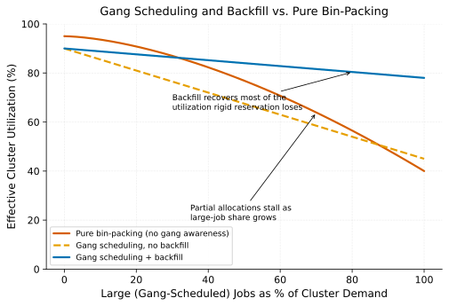

# Gang Scheduling for Distributed Jobs

> **One-liner:** A distributed training job needs all its workers placed simultaneously or none at all — partial allocation risks deadlock, not just inefficiency.

## Symptom

- A distributed training job submitted to a cluster shows some of its worker pods
  running while others remain pending indefinitely, and the running workers make no
  actual progress.
- Two large jobs, each needing more capacity than is currently free, each get
  partially scheduled and then neither can proceed nor be scheduled to completion.
- A job that requested N workers and received all N starts and runs correctly, but a
  job of the same size submitted moments later, when slightly less capacity is free,
  hangs with partial placement rather than being queued cleanly to wait for full
  capacity.
- Cluster-wide GPU utilization looks nontrivial, but a meaningful fraction of that
  utilization is partially-scheduled jobs making zero progress while holding
  resources.

## Mechanism

A distributed training job using data, tensor, or pipeline parallelism (see
[Composing Parallelism Strategies](../pretraining-infrastructure/composing-parallelism-strategies.md))
is not a collection of independent tasks — it's one logical computation whose workers
have to communicate with each other via collective operations, and none of them can
make meaningful progress until every worker they need to communicate with is up and
reachable. A scheduler that places each worker pod independently, as capacity
happens to become available for each one individually, can produce exactly the
partial-allocation symptom described above: some workers running and idle, waiting for
peers that haven't been placed yet, consuming resources while contributing zero useful
work.

The more severe version of this failure is a resource deadlock: if two large jobs each
need, say, 512 GPUs, and only 768 are free, an allocator with no gang-scheduling
awareness might place 400 GPUs' worth of Job A and 368 GPUs' worth of Job B
simultaneously — neither job can now proceed (each is missing workers), and neither
job's partial allocation can be extended to completion without one of them releasing
resources first, which neither will do voluntarily since each believes it's
legitimately waiting for its remaining capacity.

Gang scheduling solves this by treating a distributed job's full set of workers as a
single atomic scheduling unit: either the scheduler can place all of them
simultaneously, or it places none of them and the job waits, fully un-started, in a
queue. This trades some scheduling flexibility (a job can't start "mostly," it has to
wait for full capacity) for the guarantee that any job that does start can actually
make progress, and that partial allocations never accumulate into a deadlock.

Vanilla Kubernetes has no native concept of this atomicity — its default scheduler
places each pod independently. Gang-scheduling-aware systems (Volcano, Kueue, and
SLURM natively) implement this atomic-placement guarantee as a first-class scheduling
primitive, typically via a "PodGroup" or equivalent concept representing the full set
of pods that must be scheduled together.

Pure bin-packing looks fine at a low share of large jobs, but effective utilization
collapses as large-job share grows, because partial allocations stall rather than
complete useful work. Rigid gang scheduling avoids that collapse but leaves capacity
idle waiting for reservations to fill; adding backfill recovers most of that lost
utilization without giving up the atomicity guarantee.

## Real-world sightings

Volcano's project documentation explicitly frames gang scheduling as its core
motivating feature, describing the deadlock and partial-progress failure modes of
vanilla Kubernetes scheduling for batch/ML workloads as the direct problem it exists
to solve.

Kueue's design documentation similarly frames workload-level (rather than pod-level)
admission and scheduling as necessary specifically for batch and ML training jobs,
where a job's constituent pods have to be treated as an inseparable unit rather than
independently schedulable — reflecting the same underlying requirement Volcano
addresses via a different implementation approach.

SLURM's native gang-scheduling support, predating both of these Kubernetes-ecosystem
tools by decades, reflects that this requirement is not new to ML workloads
specifically — HPC batch scheduling has needed and solved this exact problem for
tightly-coupled MPI-style applications for a long time, and Kubernetes-native
gang-scheduling tooling is, in a real sense, importing an established HPC solution
into a different scheduling substrate.

## Mitigations

### Adopting a gang-scheduling-aware scheduler or queue

**What it is:** Use Volcano, Kueue, or SLURM's native gang scheduling to guarantee a
distributed job's workers are placed atomically, rather than relying on
independent, pod-by-pod placement.

**Cost:** Adds a scheduling/queuing component to deploy and operate (for
Kubernetes-based clusters), and requires expressing jobs in whatever job-group
abstraction the chosen tool provides rather than raw individual pod specs.

**How it backfires:** A gang-scheduling system misconfigured to compute the wrong
"group size" for a job (e.g., not accounting for all required pod types, such as a
coordinator pod alongside worker pods) can still produce partial-allocation behavior,
just with an extra layer of tooling that was supposed to prevent exactly that.

### Backfill scheduling to preserve utilization alongside atomicity

**What it is:** Combine gang scheduling with backfill (see
[Gang Scheduling vs. Bin-Packing](../../foundations/gang-scheduling-vs-bin-packing.md))
so smaller jobs can use capacity that's reserved but not yet needed by a queued large
job, without violating the large job's atomicity guarantee.

**Cost:** Requires accurate estimates of job duration to know how much backfill room
actually exists before the large job's reserved capacity is needed.

**How it backfires:** Backfill jobs that run longer than estimated can delay the
large gang-scheduled job's start, since the scheduler now has to wait for the backfill
job to actually vacate before honoring the atomic placement guarantee.

### Admission-time capacity checks before queueing

**What it is:** Check whether a job's total resource requirement could ever be
satisfied by the cluster's total capacity (not just currently free capacity) before
admitting it to the queue, catching jobs that request more than the cluster could ever
provide.

**Cost:** Requires maintaining accurate cluster capacity information and validating
against it at admission time, adding a check that a naive "just submit and wait"
workflow wouldn't have.

**How it backfires:** A capacity check based on total cluster size doesn't account for
transient unavailability (nodes down for maintenance), so a job that should
eventually be schedulable might be rejected prematurely if the check is too strict
about current-moment capacity rather than eventual capacity.

## Interactions

- [Gang Scheduling vs. Bin-Packing](../../foundations/gang-scheduling-vs-bin-packing.md) —
  the foundational tension this pattern's specific failure mode and mitigation are
  drawn from.
- [Topology-Aware Placement](topology-aware-placement.md) — even a correctly
  gang-scheduled job can underperform if its atomically-placed workers are spread
  across a poor network topology.
- [Hierarchical Fair-Share with Borrowing](hierarchical-fair-share-with-borrowing.md) —
  gang scheduling determines *whether* a job can start atomically; fair-share
  determines *whose* job gets priority when several are competing for the same
  atomic placement.

## References

- Volcano Project Documentation. *Volcano: A Kubernetes Native Batch Scheduling
  System*. Describes gang scheduling as a core, motivating design feature.
- Kubernetes SIG Scheduling. *Kueue Documentation*. Describes workload-level
  admission and scheduling for batch/ML jobs.
- SLURM Documentation. *Gang Scheduling*. Describes SLURM's native, long-established
  gang-scheduling implementation for HPC batch jobs.
