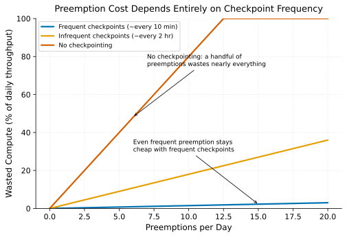

# Preemption & Checkpoint-Gated Interruption

> **One-liner:** Preempting a job to free capacity for higher-priority work only avoids wasting progress if the preempted job can actually resume from a recent checkpoint.

## Symptom

- A preempted job restarts from the very beginning after being evicted, losing hours
  or days of progress, because it had no recent checkpoint to resume from.
- Researchers avoid submitting jobs to a preemptible queue entirely, even when it
  would give them faster access to capacity, because past preemptions cost them
  significant, un-recovered progress.
- A high-priority job's preemption of a lower-priority one is technically successful
  (capacity is freed quickly) but the net system-wide throughput is worse than not
  preempting at all, once the preempted job's lost and re-done work is accounted for.
- Preemption events cluster around specific times or teams in a way that erodes trust
  in the scheduling system's fairness, even when the underlying priority logic is
  working as designed.

## Mechanism

Preemption — forcibly stopping a lower-priority job to free its resources for a
higher-priority one — is a standard mechanism for letting priority actually mean
something under contention, rather than treating all jobs as equally entitled to
whatever resources they first acquired. But preemption's *net* benefit depends
entirely on how much progress the preempted job loses, and that depends entirely on
whether it can resume cleanly from a recent checkpoint (see
[Distributed Checkpointing at Scale](../pretraining-infrastructure/distributed-checkpointing-at-scale.md)).

A job with frequent, reliable checkpoints loses at most the progress since its last
checkpoint when preempted — a bounded, usually small cost. A job with infrequent or no
checkpointing loses everything back to its last checkpoint (or its start, if it never
checkpointed), which can be a very large cost relative to the capacity freed for the
preempting job. This means preemption policy and checkpoint policy are not
independent decisions — a scheduler that preempts jobs without regard to their
checkpoint recency can produce a net negative outcome: more total compute wasted by
the preempted job's lost progress than was gained by giving the higher-priority job
faster access to capacity.

With frequent checkpoints, even a high preemption rate stays cheap — each event only
costs the small amount of progress since the last checkpoint. Without checkpointing,
a handful of preemptions per day wastes nearly all of a job's throughput, since every
preemption restarts it from scratch.

**Checkpoint-gated preemption** makes this dependency explicit: eligibility for
preemption is conditioned on a job actually having a sufficiently recent checkpoint
to make preemption's cost acceptable — jobs without recent checkpoints are either
ineligible for preemption, or preemption is delayed until the job reaches its next
checkpoint boundary. This aligns the mechanism's actual cost with the policy's intent:
preemption should reallocate capacity efficiently, not simply destroy work
unpredictably.

The trust dimension matters as much as the mechanical one: researchers who've been
burned by losing significant progress to preemption rationally avoid preemptible
capacity even when it would otherwise serve them well, which undermines the entire
point of having a preemptible tier in the first place (see
[Utilization vs. Researcher Velocity](utilization-vs-researcher-velocity.md)). A
non-preemptible quota per team or user, guaranteeing some minimum capacity that's
never subject to this risk, is a common mitigation for exactly this trust problem.

## Real-world sightings

Kubernetes' native Priority and Preemption feature explicitly documents preemption's
mechanics (evicting lower-priority pods to satisfy a higher-priority pod's
scheduling requirement) but leaves the question of what a preempted workload does
about lost progress entirely up to the workload itself — this is a deliberate
separation of concerns, but it means the checkpoint-gating logic described here has to
be built at the application or platform layer, not assumed from the base
preemption mechanism.

Run:ai's and similar GPU-scheduling platforms' documentation on preemption policies
explicitly discuss checkpoint-awareness and grace periods (giving a preempted job time
to checkpoint before actually being evicted, rather than an instantaneous kill) as
features specifically motivated by the cost-of-lost-progress problem — an explicit
acknowledgment that naive, immediate preemption without any checkpoint consideration
produces worse net outcomes than a checkpoint-aware alternative.

## Mitigations

### Grace-period preemption allowing a final checkpoint

**What it is:** On a preemption decision, send the target job a signal and a grace
period before actual termination, giving it time to write a final checkpoint rather
than being killed instantaneously.

**Cost:** Delays the preempting job's actual start by the grace period duration, which
partially offsets the responsiveness benefit preemption is meant to provide.

**How it backfires:** A grace period set too short doesn't reliably give a job enough
time to complete a checkpoint write, especially for large, sharded distributed
checkpoints (see
[Distributed Checkpointing at Scale](../pretraining-infrastructure/distributed-checkpointing-at-scale.md))
that themselves take meaningful time; set too long, it defeats much of the purpose of
fast preemptive reallocation.

### Checkpoint-recency-gated preemption eligibility

**What it is:** Only mark a job as eligible for preemption if it has a checkpoint
within some acceptable recency window, deferring preemption of jobs that don't until
they next checkpoint (or exempting them from preemption entirely).

**Cost:** Reduces the pool of jobs actually available for preemption at any given
moment, which can delay a high-priority job's access to capacity if most currently
running jobs happen to be checkpoint-stale at that moment.

**How it backfires:** A job that deliberately avoids frequent checkpointing (perhaps
to minimize checkpoint overhead — see the Young-Daly tradeoff in
[Distributed Checkpointing at Scale](../pretraining-infrastructure/distributed-checkpointing-at-scale.md))
can inadvertently make itself effectively non-preemptible, which may not be the
intended policy outcome even though it's a rational individual response to the gating
rule.

### Non-preemptible quotas to preserve trust in preemptible capacity

**What it is:** Guarantee each team or user a baseline, non-preemptible capacity
allocation, so preemption only ever affects capacity beyond that guaranteed minimum.

**Cost:** Reduces the total pool of capacity available for opportunistic,
preemption-based reallocation, since some capacity is now walled off as
non-preemptible regardless of priority.

**How it backfires:** A non-preemptible quota sized too generously effectively
recreates static, siloed capacity allocation and undermines the utilization benefits
preemption-based sharing was meant to provide in the first place.

## Interactions

- [Distributed Checkpointing at Scale](../pretraining-infrastructure/distributed-checkpointing-at-scale.md) —
  the direct dependency that determines preemption's actual cost; this pattern is
  effectively unimplementable well without it.
- [Utilization vs. Researcher Velocity](utilization-vs-researcher-velocity.md) —
  preemption policy is one of the concrete mechanisms this broader tension is actually
  negotiated through.
- [Hierarchical Fair-Share with Borrowing](hierarchical-fair-share-with-borrowing.md) —
  preemption is often the enforcement mechanism that makes fair-share borrowing
  reversible (an over-borrowing tenant's jobs get preempted when the lending tenant's
  own demand returns).

## References

- Kubernetes Documentation. *Pod Priority and Preemption*. Describes the native
  preemption mechanism and its separation from application-level checkpoint concerns.
- Run:ai Documentation. *Preemption and Fractional GPU Scheduling*. Discusses
  checkpoint-aware grace periods and preemption policy design for GPU clusters.
- Young, J. W. *A First Order Approximation to the Optimum Checkpoint Interval*.
  Communications of the ACM, 1974. The underlying checkpoint-cost reasoning that
  determines preemption's actual cost to a job.
