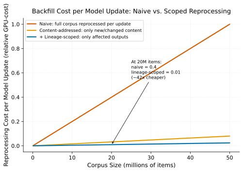

# Content-Addressed Reprocessing

> **One-liner:** Keying derived outputs by content hash and model version turns a full-corpus reprocessing job into a cheap no-op for anything that hasn't actually changed.

## Symptom

- Re-running a batch inference pipeline after a minor, unrelated code change
  reprocesses the entire corpus from scratch, even though the actual model and its
  outputs are unchanged.
- A pipeline retried after a transient failure duplicates work already completed
  before the failure, rather than resuming from where it left off.
- Two concurrent invocations of the same batch job (a scheduling duplicate, or an
  operator error) both fully reprocess the same corpus, wasting GPU time on entirely
  redundant work.
- Determining whether a specific derived artifact is "up to date" relative to its
  source content and the model that should have produced it requires manual
  investigation, because there's no systematic way to check.

## Mechanism

This is the batch-inference-layer instance of the same content-addressing discipline
described in [Idempotent Incremental Enrichment](../training-data-platforms/idempotent-incremental-enrichment.md):
keying every derived output by a deterministic function of exactly what produced it —
`hash(input_content) + model_id + model_version + inference_params_hash` — makes
reprocessing naturally idempotent and makes "is this output up to date" a cheap,
deterministic lookup rather than an open question requiring investigation.

Applied specifically to batch inference: before running inference on an item, check
whether an output already exists under the key that this exact combination of input
content, model, and parameters would produce. If it does, skip — the work is already
done, correctly, and re-running it would produce an identical result at real
compute cost for zero additional value. If it doesn't, run inference and write the
result under that key. This single check-then-act pattern, applied uniformly, is what
makes retries, concurrent duplicate invocations, and partial pipeline reruns all
naturally safe: none of them can produce incorrect duplicate work, only (at worst)
redundant *key lookups*, which are vastly cheaper than redundant *inference*.

The practical payoff is largest exactly where naive reprocessing is most wasteful:
a full-corpus job triggered by a genuinely unrelated change (a code fix elsewhere in
the pipeline, a scheduling retry, a model version bump that only affects a specific
model while the job also happens to touch outputs from other, unchanged models)
collapses to processing only the genuinely-affected subset, because everything else's
content-addressed key already exists and resolves as "already done."

Naive full-corpus reprocessing cost grows linearly with corpus size, and is paid again
in full on every model update. Content-addressing bounds cost to only genuinely new or
changed content; adding lineage scoping (see
[Lineage-Scoped Backfills](lineage-scoped-backfills.md)) narrows it further to only
the specific outputs a given update actually affects — at large corpus sizes, the gap
between naive and scoped reprocessing is not incremental, it's an order of magnitude.

This mechanism does depend on one discipline holding: the key components have to
accurately capture everything that affects the output. If a model's *behavior*
changes (updated weights, changed preprocessing, a bug fix in the inference code)
without a corresponding change to its version identifier in the key, content-addressed
reprocessing will confidently and silently serve stale, incorrect results under a key
that no longer accurately represents what actually produced them — this is the single
most consequential failure mode of the entire pattern, and it fails silently rather
than loudly.

## Real-world sightings

Build systems (Bazel's remote caching, Nix's content-addressed store) are the most
mature, widely-deployed real-world implementations of exactly this content-addressing
discipline, applied to compilation and build artifacts rather than ML inference
outputs — the underlying principle (key derived artifacts by a hash of their true
inputs, skip work whose key already exists) transfers directly, even though the
specific domain differs.

Published engineering discussions of large-scale ML data enrichment pipelines
consistently describe content-addressed or hash-keyed derived-artifact storage as
the mechanism that makes model-version-driven backfills tractable at all — without it,
a full-corpus reprocessing cost has to be paid on every model update, which becomes
prohibitively expensive as both corpus size and model iteration frequency grow.

## Mitigations

### Comprehensive, accurate key composition

**What it is:** Ensure the content-addressed key genuinely captures every factor that
affects the output — input content, model identity and version, and all inference
parameters that could change results — leaving nothing that affects output but isn't
reflected in the key.

**Cost:** Requires careful, disciplined auditing of what actually affects a given
model's output, which can be non-obvious for complex inference pipelines with many
configurable parameters.

**How it backfires:** Any omitted factor (an environment variable affecting
numerical precision, an implicit default that changes between library versions)
becomes a silent correctness gap — the key looks complete, but isn't, and the failure
mode is silent stale-result serving rather than an obvious error.

### Explicit model version bumping as a release discipline

**What it is:** Treat any change to model weights, preprocessing, or inference
behavior as requiring an explicit version bump, enforced as a release-process
discipline rather than left to individual engineer judgment.

**Cost:** Requires process discipline and potentially tooling (a linter or CI check)
to catch cases where behavior-affecting code changed without a corresponding version
bump.

**How it backfires:** Discipline enforced only by convention, without tooling
support, erodes under time pressure — this is precisely the kind of rule that's easy
to violate accidentally rather than deliberately, which is why automated
enforcement is more reliable than a style-guide entry.

### Periodic validation against known-correct spot checks

**What it is:** Periodically re-run inference on a small, known sample of content
and compare against the content-addressed cached result, to catch cases where the
cache is silently serving stale results due to an unversioned behavior change.

**Cost:** Adds ongoing validation overhead (compute cost for the spot-check
re-runs) as an explicit tax on top of the compute savings content-addressing
otherwise provides.

**How it backfires:** A spot-check sample too small or unrepresentative can fail to
catch a genuine staleness bug that only manifests for a specific, uncommon input
characteristic not represented in the sample.

## Interactions

- [Idempotent Incremental Enrichment](../training-data-platforms/idempotent-incremental-enrichment.md) —
  the training-data-layer version of the identical content-addressing discipline this
  pattern applies at the batch-inference layer.
- [Spot-Backed Backfill Under a Budget Cap](spot-backed-backfill-under-budget.md) —
  content-addressed idempotency is the precondition that makes spot-backed,
  preemptible backfills safe, since interrupted work can simply be redone (or, if
  already completed, skipped) without correctness risk.
- [Lineage-Scoped Backfills](lineage-scoped-backfills.md) — a complementary
  mechanism for further scoping reprocessing to only what's genuinely affected,
  layered on top of content-addressing's already-done-work check.

## References

- Bazel Documentation. *Remote Caching and Content-Addressed Storage*. Describes
  content-addressing as a general mechanism for idempotent, deduplicating build and
  processing systems.
- Nix Documentation. *The Nix Store*. Describes content-addressed storage as the
  foundation of reproducible, deduplicating build processes.
- Dean, J. and Ghemawat, S. *MapReduce: Simplified Data Processing on Large Clusters*.
  OSDI 2004. Foundational treatment of large-scale batch reprocessing this approach
  improves on for the incremental, idempotent case.
