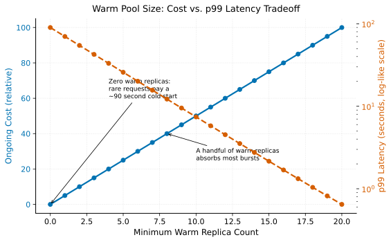

# Cold Starts vs. Warm Pools

> **One-liner:** Scaling GPU capacity to zero saves money but reintroduces multi-minute cold starts on the next request; keeping capacity warm eliminates that latency at continuous cost.

## Symptom

- A serving endpoint configured to scale to zero when idle produces a large latency
  spike for the first request after any idle period, sometimes on the order of
  minutes, even though subsequent requests are served quickly.
- Under bursty, intermittent traffic, a scale-to-zero policy causes the endpoint to
  repeatedly cold-start, since idle periods between bursts are long enough to trigger
  scale-down but traffic never stays away long enough to justify it economically.
- A cost review flags an "always-on" minimum replica count as wasteful capacity,
  without accounting for the latency cost that removing it would introduce.
- GPU capacity requested to handle a cold-start scale-up event isn't available
  quickly (or at all, under scarcity), turning a latency problem into an outright
  availability problem.

## Mechanism

Provisioning GPU serving capacity involves a genuine cost/latency tradeoff at the
extremes, and cold start is where that tradeoff becomes most visible. Scaling
capacity down to zero when idle saves real, ongoing cost — no GPU is running, no bill
is accruing — but the next request after a scale-to-zero has to wait for entirely new
capacity to become available: a node has to be provisioned (or an existing node found
with room), a container image (often several gigabytes for a serving stack plus model
weights) has to be pulled, and the model's weights (potentially tens of gigabytes for
a large model) have to be loaded into GPU memory before the request can actually be
served. This sequence can easily take minutes, not milliseconds — a latency spike
wildly out of proportion to the service's normal steady-state response time.

With zero warm replicas, occasional requests pay the full cold-start penalty. A
relatively small warm pool absorbs most realistic traffic bursts, dropping p99 latency
by orders of magnitude for a proportionally modest increase in ongoing cost — the
steepest part of the tradeoff curve is usually crossed with just a handful of warm
replicas, not a large fleet.

Keeping a minimum warm pool of already-provisioned, already-loaded capacity
eliminates this cold-start latency entirely for requests that land within the warm
pool's capacity, at the direct, continuous cost of paying for that capacity whether
or not it's actively serving requests at any given moment. This is the same
utilization-versus-responsiveness tension described generally in
[Utilization vs. Researcher Velocity](../gpu-scheduling/utilization-vs-researcher-velocity.md),
applied here to serving latency rather than research iteration speed: a warm pool is
deliberately under-utilized capacity, purchased specifically to buy latency
guarantees that a fully-utilized, scale-to-zero-capable system cannot provide.

GPU scarcity makes this tradeoff sharper than the equivalent tradeoff for CPU-based
services: CPU capacity for a cold-started scale-up event is usually readily available
on demand, but GPU capacity — especially for specific, in-demand GPU types — may not
be, turning what would be "a slow cold start" for CPU services into "a cold start that
might not complete promptly, or at all, if the region or provider is out of the
requested GPU type" for GPU-backed services. This elevates cold-start risk from a
pure latency concern to a genuine availability risk under scarcity.

## Real-world sightings

Serverless GPU inference platforms (various cloud providers' GPU-backed serverless
offerings) explicitly document cold-start latency as a known, first-class
characteristic of scale-to-zero GPU serving, with published guidance on techniques to
mitigate it (smaller container images, weight caching, pre-warming) reflecting that
this is a widely-encountered, actively-addressed operational concern rather than a
rare edge case.

KServe's documentation on autoscaling explicitly supports configuring a minimum
replica count precisely to avoid scale-to-zero cold starts for latency-sensitive
services, framing this as a deliberate configuration choice trading cost for latency
guarantee, consistent with the general tradeoff described above.

## Mitigations

### Minimum warm replica count for latency-sensitive services

**What it is:** Configure a nonzero minimum replica count for services where
cold-start latency is unacceptable, ensuring at least some capacity is always
immediately available regardless of recent traffic.

**Cost:** Pays for genuinely idle capacity continuously, in direct proportion to
however many replicas the minimum requires.

**How it backfires:** Sizing the minimum too conservatively (too few warm replicas)
doesn't fully eliminate cold starts during traffic bursts exceeding the warm pool's
capacity; sizing it too generously wastes capacity that a cost review will
(correctly) flag as underutilized.

### Reducing cold-start duration directly

**What it is:** Shrink container image size, cache model weights on local fast
storage (NVMe) rather than requiring a fresh download on every cold start, and
optimize the model-loading path specifically, to reduce however long a cold start
actually takes even when one does occur.

**Cost:** Requires engineering investment in image and weight-loading optimization,
which is ongoing maintenance work distinct from simply provisioning more warm
capacity.

**How it backfires:** These optimizations reduce but don't eliminate cold-start
latency — even a well-optimized cold start is still slower than an already-warm
replica, so this mitigation reduces the severity of the tradeoff without eliminating
the need to make it.

### Predictive pre-warming based on traffic pattern forecasting

**What it is:** Scale up warm capacity proactively, ahead of anticipated demand
(based on historical traffic patterns or known upcoming events), rather than
reactively scaling only in response to already-arrived traffic.

**Cost:** Requires reasonably accurate traffic forecasting, and pre-warmed capacity
provisioned for a forecast that doesn't materialize is wasted cost, the same as any
other over-provisioned warm capacity.

**How it backfires:** A forecast that's wrong in either direction produces either
wasted pre-warmed capacity (over-forecast) or an unaddressed cold-start risk
(under-forecast) — this mitigation's value is bounded by forecast accuracy, which is
itself an imperfect prediction problem.

## Interactions

- [Utilization vs. Researcher Velocity](../gpu-scheduling/utilization-vs-researcher-velocity.md) —
  the general utilization-versus-responsiveness tension this pattern applies
  specifically to serving latency.
- [Multi-Region GPU Capacity Failover](multi-region-gpu-capacity-failover.md) — GPU
  scarcity's effect on cold-start recovery is a specific instance of the broader
  capacity-availability risk that pattern addresses more generally.
- [Tiered SLOs for Mixed Traffic](tiered-slos-for-mixed-traffic.md) — warm-pool
  sizing is naturally a tiered decision: latency-critical traffic tiers justify warm
  capacity that best-effort tiers may not.

## References

- KServe Documentation. *Autoscaling — Scale to Zero*. Describes minimum replica
  configuration and its tradeoff against cold-start latency.
- Google Cloud Documentation. *Vertex AI Prediction — Cold Start Optimization*.
  Discusses cold-start mitigation techniques for GPU-backed serving.
- Ray Serve Documentation. *Autoscaling*. Describes replica scaling configuration and
  its latency implications for serving workloads.
