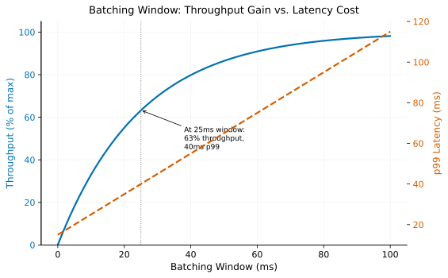

# Continuous & Dynamic Batching

> **One-liner:** Batching multiple requests together is the single biggest GPU utilization lever in serving, and the batching window is a direct, tunable trade against per-request latency.

## Symptom

- A serving endpoint handling requests one at a time shows low GPU utilization
  despite consistent request volume, because each individual request's forward pass
  doesn't fully exploit the GPU's parallel compute capacity.
- Enabling dynamic batching significantly improves throughput and cost-per-request,
  but also measurably increases per-request latency, in a way that requires explicit
  tradeoff evaluation against the service's actual latency SLO.
- A batching window tuned for one traffic volume becomes poorly calibrated as traffic
  patterns shift — too aggressive a wait for low-traffic periods, not aggressive
  enough during traffic spikes.
- An autoregressive (token-by-token generation) model served with static, request-
  level batching shows poor throughput compared to the same model served with
  continuous batching, because static batching can't accommodate requests of very
  different generation lengths efficiently.

## Mechanism

A single inference request rarely uses a GPU's full parallel compute capacity — a
GPU is built to process many operations simultaneously, and a batch size of one
leaves most of that parallelism unused. Batching multiple concurrent requests
together into a single forward pass is the most direct lever for improving GPU
utilization in a serving context, since it lets the GPU actually operate closer to its
designed capacity rather than processing requests in a way that under-utilizes it.

**Dynamic batching** (as implemented by NVIDIA Triton and similar general-purpose
serving frameworks) accumulates incoming requests for a configurable, bounded window
of time (or until a maximum batch size is reached, whichever comes first), then
processes the accumulated batch together. This is a direct, explicit tradeoff: a
longer batching window accumulates larger batches (better utilization, better
throughput-per-cost) at the cost of added latency for the requests that arrived
early in the window and had to wait for it to fill or expire. There is no batching
window setting that maximizes both throughput and minimizes latency simultaneously —
the batching window is precisely the tunable dial controlling this tradeoff.

Throughput rises steeply at first as the window grows, then flattens as batches
approach their size cap — while p99 latency grows almost linearly with the window the
entire time, since a request unlucky enough to arrive right as the window opens waits
nearly the full window regardless of how full the batch eventually gets.

**Continuous batching** (the standard technique for serving autoregressive generative
models, popularized by vLLM's implementation) addresses a specific limitation of
static, request-level batching for this workload shape: because different requests
in a generative model finish generating at different token counts, a static batch
has to wait for its *slowest* member to finish before the batch slot can be reused
for a new request — wasting the GPU slots of already-finished requests while they
wait idle for their batch-mates. Continuous batching instead operates at the level of
individual generation steps rather than whole requests: as soon as any request in the
batch finishes, its slot is immediately backfilled with a new, waiting request,
without needing to wait for every other member of the original batch to also finish.
This keeps GPU utilization consistently high regardless of the variance in individual
requests' generation length, which static, request-level batching cannot achieve for
workloads with this length variance.

## Real-world sightings

NVIDIA Triton Inference Server's documentation describes dynamic batching's
configurable window and maximum batch size explicitly as a latency-versus-throughput
tuning mechanism, framing the choice as workload- and SLA-dependent rather than
prescribing a single universally-correct setting.

The vLLM paper and project documentation (Kwon et al., "Efficient Memory Management
for Large Language Model Serving with PagedAttention," SOSP 2023) describes
continuous batching (alongside PagedAttention's memory management) as directly
motivated by the GPU-utilization inefficiency of static batching for autoregressive
generation specifically, and its adoption across essentially every major LLM serving
framework since reflects how significant and widely-applicable this specific
insight has proven.

## Mitigations

### Tuning batching window against measured latency SLO impact

**What it is:** Set the dynamic batching window based on the service's actual
latency SLO, measuring the real latency-versus-throughput tradeoff empirically for
the specific model and traffic pattern rather than using a default value.

**Cost:** Requires load-testing and profiling to characterize the actual tradeoff
curve for a specific model and deployment, which is more upfront work than accepting
a framework default.

**How it backfires:** A window tuned for one traffic volume can become poorly
calibrated as volume shifts — the same window that produced good batch sizes at
moderate traffic may produce nearly-empty batches (wasting the window's latency cost
for no throughput benefit) at low traffic, or insufficiently large batches relative
to demand at high traffic.

### Continuous batching for autoregressive/generative workloads specifically

**What it is:** Use a serving framework implementing continuous batching (vLLM or
equivalent) for autoregressive generation workloads, rather than static,
request-level batching that can't efficiently handle variable generation length.

**Cost:** Requires adopting a specific serving framework built for this pattern,
which may require migrating from a more general-purpose serving stack.

**How it backfires:** Continuous batching's benefit is specific to workloads with
genuinely variable per-request completion time (autoregressive generation being the
canonical case) — applying it to a workload without this characteristic doesn't
provide the same benefit and adds framework-specific complexity for little gain.

### Monitoring actual achieved batch size, not just configured maximums

**What it is:** Track the actual batch sizes being achieved in production, not just
the configured maximum, since a batching window that's too short relative to actual
request arrival rate can leave real batches far smaller than the configured ceiling
would allow.

**Cost:** Requires instrumentation exposing per-batch size as an operational metric,
which isn't always exposed by default.

**How it backfires:** None specific — the absence of this monitoring means a
poorly-calibrated batching window (achieving much smaller batches than intended) is
discovered only through generally poor throughput, rather than through a direct,
attributable signal.

## Interactions

- [Serving Mode Selection](serving-mode-selection.md) — batching operates within
  whichever serving mode is chosen; it's a complementary, not competing, lever for
  GPU utilization.
- [Quantization & Compiled Runtimes](quantization-and-compiled-runtimes.md) — a
  separate, compounding lever for serving efficiency, operating at the level of
  per-operation compute cost rather than request-batching.
- [Tiered SLOs for Mixed Traffic](tiered-slos-for-mixed-traffic.md) — batching window
  tuning is one of the concrete mechanisms through which different latency tiers are
  actually differentiated in practice.

## References

- NVIDIA Triton Inference Server Documentation. *Dynamic Batching*. Describes
  configurable batching window and maximum batch size as a tunable latency/throughput
  tradeoff.
- Kwon, W. et al. *Efficient Memory Management for Large Language Model Serving with
  PagedAttention*. SOSP 2023. The vLLM paper describing continuous batching and
  PagedAttention.
- Yu, G-I. et al. *Orca: A Distributed Serving System for Transformer-Based
  Generative Models*. OSDI 2022. Earlier foundational work on iteration-level
  scheduling for generative model serving, closely related to continuous batching.
