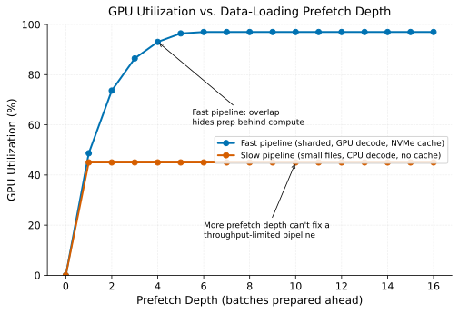

# Data Loading as the Real Bottleneck

> **One-liner:** GPUs sitting idle waiting for the next batch is usually an I/O and decode problem, not a compute problem, and the fix is overlap and locality, not more GPUs.

## Symptom

- GPU utilization during training is consistently well below expected, with periodic
  gaps that correlate with batch boundaries rather than with the model's own
  compute-heavy operations.
- Increasing batch size or adding more GPUs doesn't improve overall throughput
  proportionally, because the data pipeline supplying batches can't keep pace with
  additional compute demand.
- Profiling shows significant time in `DataLoader.__next__` or equivalent, rather than
  in the forward/backward pass, when it should be the reverse for a well-tuned
  pipeline.
- The training job's CPU utilization is pegged while GPU utilization lags, suggesting
  the bottleneck has moved from the expensive resource to the cheap one.

## Mechanism

A training step logically needs three things in sequence: fetch the next batch's raw
data, prepare it (decode, augment, collate) for the model, and run the model's
forward/backward pass. If preparation for batch N+1 doesn't happen concurrently with
compute for batch N, the GPU sits idle during every data-preparation phase — and given
how expensive and scarce GPU time is relative to CPU/network time, an idle GPU waiting
on cheap resources is close to the worst possible resource allocation a training
system can make.

The fix is **overlap**: structure the pipeline so that while the GPU computes on the
current batch, CPU workers are concurrently fetching and preparing the *next* batch,
so that by the time the GPU finishes, the next batch is already ready. This requires
enough parallelism in the data-loading path (multiple worker processes/threads,
adequate prefetch depth) that preparation genuinely keeps pace with compute, and it
requires the preparation *itself* to be fast enough that even with full overlap, it
doesn't simply become the new bottleneck once hidden behind compute stops sufficing.

A fast pipeline (sharded reads, GPU decode, local caching) reaches high utilization
with modest prefetch depth, since overlap has little to hide. A slow pipeline (small
files, CPU decode, no caching) plateaus far lower regardless of prefetch depth —
deeper prefetch can hide latency, but it cannot manufacture throughput the pipeline
doesn't have.

This is compounded by everything in
[Training Data Platforms](../training-data-platforms/index.md): naive small-file
access patterns (see [The Shard Pattern for Training Data](../training-data-platforms/the-shard-pattern-for-training-data.md))
make fetching slow; CPU-bound decode for expensive modalities like video (see
[GPU-Accelerated Video Decode](../training-data-platforms/gpu-accelerated-video-decode.md))
makes preparation slow; and inadequate shuffle-buffer sizing (see
[Two-Level Shuffle for Streaming Datasets](../training-data-platforms/two-level-shuffle-for-streaming-datasets.md))
adds its own startup and steady-state overhead. Data loading being the real bottleneck
in modern large-scale training is less a single failure mode and more the aggregate
consequence of these upstream data-platform decisions showing up as GPU idle time at
training time.

Locality matters as much as raw throughput: a first epoch streaming directly from
remote object storage pays full network latency for every sample; a subsequent epoch
that can hit a local NVMe cache (see
[Object Storage vs. Parallel Filesystem](../training-data-platforms/object-storage-vs-parallel-filesystem.md))
pays far less. A pipeline that doesn't cache anything locally re-pays the full remote
read cost every single epoch, for the entire dataset, which for a multi-epoch training
run is a substantial, avoidable recurring cost.

## Real-world sightings

NVIDIA's DALI documentation frames its entire design rationale around exactly this
observation — that CPU-bound data preprocessing, not GPU compute, is frequently the
actual bottleneck for vision and video training pipelines, and structures its
GPU-accelerated preprocessing specifically to eliminate this bottleneck by moving
preparation work onto (or overlapped with) the GPU.

PyTorch's own `DataLoader` documentation explicitly discusses `num_workers`,
`prefetch_factor`, and `pin_memory` as the concrete mechanisms for achieving overlap
between data preparation and compute, and troubleshooting guidance across the PyTorch
ecosystem consistently identifies undersized worker counts or prefetch depth as the
most common root cause of GPU-utilization complaints during training.

## Mitigations

### Sizing data-loading worker count and prefetch depth to actually overlap

**What it is:** Configure enough parallel data-loading workers and sufficient prefetch
depth that batch preparation genuinely completes, on average, faster than the model's
own compute time per batch.

**Cost:** More workers consume more CPU and memory on the training node, competing
with other processes for those resources, and excessive prefetch depth increases
memory usage for buffered, not-yet-consumed batches.

**How it backfires:** A worker count and prefetch depth tuned for one model's compute
time per batch becomes insufficient if the model changes (a larger model with more
compute per batch might tolerate a smaller data pipeline; a smaller, faster model
might reveal that today's data pipeline was never actually fast enough, just
previously hidden behind a slower model's compute time).

### Caching hot shards locally for multi-epoch training

**What it is:** Cache shards on local NVMe (or a shared fast filesystem) after the
first epoch's remote read, so subsequent epochs read from local, low-latency storage
rather than re-fetching from remote object storage every time.

**Cost:** Requires local (or shared fast-tier) storage capacity sized to hold a
meaningful working set, and cache management logic to handle eviction when the
dataset exceeds available cache capacity.

**How it backfires:** A cache sized for a dataset that later grows can silently
degrade from "mostly cache hits" to "mostly cache misses" as the working set outgrows
capacity, with the resulting slowdown easy to misattribute to something else since the
pipeline still runs, just slower.

### Profiling to distinguish data-loading bottleneck from compute bottleneck

**What it is:** Use a training profiler to explicitly measure time spent in data
loading versus compute per step, rather than assuming low GPU utilization implies a
compute-side problem.

**Cost:** Requires profiling tooling and the discipline to check it before reaching
for compute-side optimizations (larger batch size, mixed precision, more GPUs) that
won't help a data-loading-bound job.

**How it backfires:** None specific — skipping this diagnostic step is precisely what
leads teams to add more GPUs to a data-loading-bound job, which doesn't help and can
even make the imbalance worse by increasing aggregate data demand without addressing
the actual constraint.

## Interactions

- [The Shard Pattern for Training Data](../training-data-platforms/the-shard-pattern-for-training-data.md) —
  the storage-layer precondition for data loading to be fast enough to overlap with
  compute at all.
- [GPU-Accelerated Video Decode](../training-data-platforms/gpu-accelerated-video-decode.md) —
  the specific, dominant contributor to data-loading bottlenecks for video-modality
  training.
- [Interconnect-Bound Distributed Training](interconnect-bound-distributed-training.md) —
  a distinct bottleneck (communication, not data loading) that produces a
  superficially similar symptom (low GPU utilization) but requires an entirely
  different diagnosis and fix.

## References

- NVIDIA DALI Documentation. *Data Loading Library Overview*. Motivates
  GPU-accelerated preprocessing as a response to CPU-bound data pipeline bottlenecks.
- PyTorch Documentation. *torch.utils.data.DataLoader*. Describes `num_workers`,
  `prefetch_factor`, and overlap mechanics for the standard PyTorch data pipeline.
- Mohan, J. et al. *Analyzing and Mitigating Data Stalls in DNN Training*. VLDB 2021.
  Empirical study characterizing data-loading bottlenecks across real training
  workloads.
