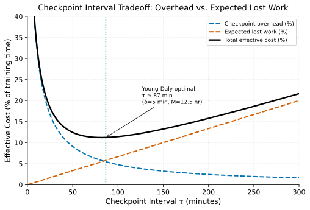

# Distributed Checkpointing at Scale

> **One-liner:** Checkpoint frequency is a real optimization problem, not a guess — too rare risks catastrophic lost work, too frequent competes with training throughput.

## Symptom

- After a failure, a training job loses hours of progress, traceable to a checkpoint
  interval that was set conservatively wide "to avoid overhead" without reference to
  actual failure rate.
- Checkpoint writes visibly compete with training throughput, showing up as periodic
  step-time spikes at each checkpoint interval.
- A checkpoint interval tuned early in a job's life (when the fleet was smaller or
  newer) becomes miscalibrated as the job scales to more GPUs or runs longer, since
  the fleet's aggregate failure rate has changed but the interval hasn't been
  revisited.
- Checkpoint write time itself grows as model size grows, and at some model size,
  checkpoint duration starts approaching or exceeding the configured interval between
  checkpoints.

## Mechanism

Checkpoint frequency is a genuine cost-optimization problem, not an arbitrary setting:
every checkpoint costs time (writing model, optimizer, and dataloader state), which is
time not spent training — call this cost δ. Every failure costs the work done since
the last checkpoint, which has to be redone — and the *expected* cost of this, given a
system mean-time-between-failures M (see
[Failure as the Steady State at Fleet Scale](../../foundations/failure-as-the-steady-state.md)),
grows with how long the interval between checkpoints is left uncovered.

The Young-Daly optimal checkpoint interval formula makes this tradeoff explicit:
the optimal interval τ is approximately `sqrt(2 · δ · M)` — the interval that
minimizes the *combined* cost of checkpoint overhead (paid frequently, at a known
fixed cost) and expected lost work from failure (paid rarely, but with severity
proportional to the interval length). This formula captures the core insight
precisely: checkpointing too frequently wastes throughput on unnecessary overhead;
checkpointing too rarely risks losing large amounts of progress to failures that,
per [Failure as the Steady State at Fleet Scale](../../foundations/failure-as-the-steady-state.md),
are a near-certainty over a long enough run at large enough scale — and the optimum
interval depends on both δ and M, not on either alone.

Checkpoint overhead falls as the interval grows (checkpointing less often); expected
lost work rises (a failure now costs more redone progress on average). The total cost
curve is U-shaped, and its minimum — the Young-Daly optimal interval — sits where these
two costs are balanced, not at either extreme.
depends on both variables, not a fixed rule of thumb.

At the scale of thousands of GPUs training for weeks, both δ and M are large and
consequential enough that guessing at a checkpoint interval, rather than deriving it
from measured or estimated values, leaves real throughput or real risk on the table.
Distributed checkpointing itself — writing a sharded model's state, where different
GPUs each hold a fragment (see
[Composing Parallelism Strategies](composing-parallelism-strategies.md)) — has to
write each shard from its owning rank in parallel, and a common technique is writing
first to fast local storage (NVMe) synchronously, then asynchronously copying to
durable object storage in the background while training continues, hiding most of the
checkpoint's cost behind ongoing compute rather than pausing training to fully
complete the durable write. This reduces effective δ substantially compared to a
naive, fully-synchronous checkpoint, which shifts the Young-Daly-optimal interval
tighter (more frequent checkpoints become affordable) — but the local-first write
introduces a small window of risk, since a node that fails before its local checkpoint
has finished copying to durable storage loses that specific checkpoint.

## Real-world sightings

The Young-Daly checkpoint interval formula (originating from John W. Young's 1974
paper and Daly's subsequent extension for more general failure distributions) is a
long-established result in high-performance computing fault-tolerance literature,
predating modern ML training by decades but directly applicable to the same
underlying tradeoff — it's frequently cited in large-scale ML training systems papers
and postmortems specifically because the reasoning transfers unchanged: minimize the
combined cost of checkpoint overhead and expected lost work.

PyTorch's Distributed Checkpoint (DCP) documentation describes sharded, parallel
checkpoint writing across ranks specifically to make checkpointing large,
FSDP/tensor-parallel-sharded models tractable at all, and multiple published
large-scale training reports (from organizations training frontier-scale models)
describe asynchronous, local-first-then-durable checkpoint pipelines as a standard
practice for keeping checkpoint overhead from meaningfully eating into training
throughput at scale.

## Mitigations

### Deriving checkpoint interval from the Young-Daly formula

**What it is:** Estimate checkpoint write cost δ and system MTBF M from actual
measurements, and set checkpoint interval to `sqrt(2 · δ · M)` rather than an
arbitrary default.

**Cost:** Requires reasonably accurate estimates of both δ and M, which themselves
require instrumentation and historical data that may not be readily available for a
new cluster or job.

**How it backfires:** An interval derived once from a given fleet size and checkpoint
cost becomes miscalibrated as either changes — a fleet that grows (lowering M) or a
model that grows (increasing δ) both shift the optimal interval, and a formula applied
once and never revisited degrades into exactly the "guessed and never revisited"
problem it was meant to solve.

### Asynchronous, multi-tier checkpoint writes

**What it is:** Write checkpoint shards to fast local storage synchronously (blocking
training only briefly), then copy to durable, remote storage asynchronously in the
background while training resumes.

**Cost:** Introduces a window during which the most recent checkpoint exists only on
local, non-durable storage — a node failure within that window loses that specific
checkpoint (though not necessarily more than one interval's worth of progress, since
the prior durable checkpoint is unaffected).

**How it backfires:** If the asynchronous durable copy is slower than the interval
between checkpoints (a genuine risk if δ is underestimated or storage bandwidth is
insufficient), copies can queue up and fall behind, silently eroding the durability
guarantee this mitigation is meant to provide.

### Sharded, parallel checkpoint writes matching the training parallelism layout

**What it is:** Write each rank's owned shard of model/optimizer state in parallel,
matching the sharding layout already established by FSDP/ZeRO or tensor/pipeline
parallelism, rather than consolidating to a single rank before writing.

**Cost:** Requires the checkpoint format to correctly represent the sharding layout,
and complicates restoring onto a different parallelism configuration than the one that
wrote the checkpoint.

**How it backfires:** A checkpoint sharded for one specific parallelism configuration
(a particular tensor-parallel degree, say) can require a conversion step to load into
a differently-configured resumed job, which is friction that's easy to discover only
at the moment recovery is actually needed.

## Interactions

- [Failure as the Steady State at Fleet Scale](../../foundations/failure-as-the-steady-state.md) —
  the MTBF term the Young-Daly formula depends on directly.
- [Composing Parallelism Strategies](composing-parallelism-strategies.md) — the
  sharding layout that determines how a distributed checkpoint has to be structured
  and written.
- [Elastic Training vs. Hot Spares](elastic-training-vs-hot-spares.md) — checkpoint
  interval and recovery strategy are two halves of the same fault-tolerance design;
  the checkpoint interval sets how much progress recovery has to redo.

## References

- Young, J. W. *A First Order Approximation to the Optimum Checkpoint Interval*.
  Communications of the ACM, 1974. The original checkpoint-interval optimization
  formula.
- Daly, J. T. *A Higher Order Estimate of the Optimum Checkpoint Interval for
  Restart Dumps*. Future Generation Computer Systems, 2006. Extends the formula to
  more general failure distributions.
- PyTorch Documentation. *Distributed Checkpoint (DCP)*. Describes sharded, parallel
  checkpoint writing for FSDP and other sharded training configurations.
